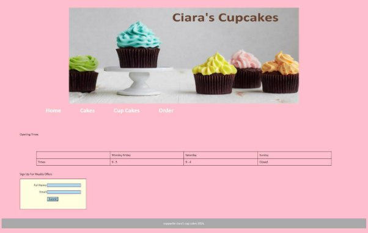
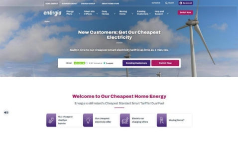
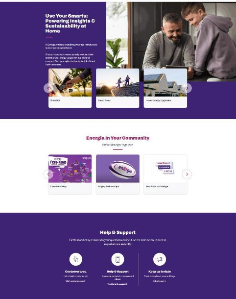
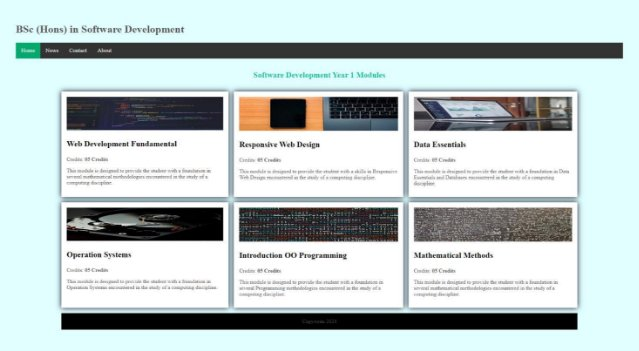
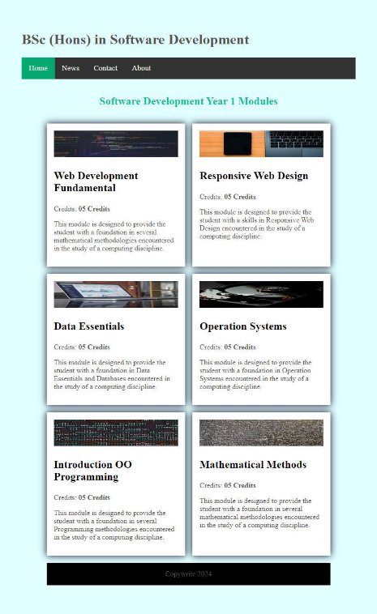
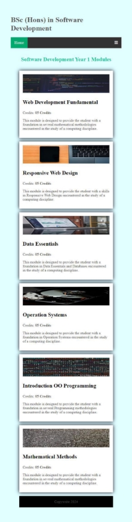
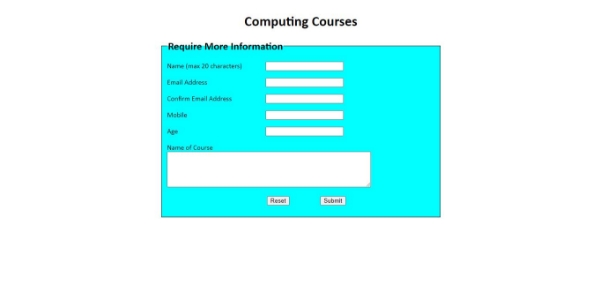

# Responsive Design and Web Dev (SODV06008) - Sample Exam Paper - 2024 - Winter

## Instructions

*Time Allowed*: 2 hours

*Instructions*:  Answer all questions

The use of programmable or text storing calculators is expressly forbidden.

Please note that where a candidate answers more than the required number of questions, the examiner will mark all questions attempted and then select the highest scoring ones.

There are no additional requirements for this paper.

## Computer Instructions

1. On your desktop create a new folder named *examRDD-YourKnumber. (Remember to replace YourKnumber with your actual K number). Create a subfolder called **images* within this folder.
2. Download the *examResources.zip* file from the Moodle Exam Module page.  It contains several files.
3. Extract these files to the newly created folder on your desktop. Place all images in the *images* sub folder.
4. Complete all activities as outlined below using your code editor to edit these files and use Microsoft Edge, Chrome or Firefox to view your files.
5. When completed, save your work, zip your entire exam folder and upload to the Moodle Exam Module page.

## Question 1 - Accessibility (12 marks)

Open the file *q1-accessibility.html* in your code editor.  

*Figure 1: q1-accessibility.html*  

There are several accessibility issues with this code. Create comments in the HTML document to highlight *six* of these issues and add your own HTML code to resolve these problems.

## Question 2 - Design (13 marks)

**Figure 2** below are screenshots of the Energia website. Open the file [q2-design.md](../sample-autumn-paper-files/q2-design.md).  Within this text document highlight **six** design principles utilised by the designers of this site to ensure a well-designed page. Include comments on text readability and layout patterns.

*Figure 2*  

## Question 3 - Responsive Design (30 marks)

Open the file *q3-layout.html.* Insert the necessary CSS code as an internal style sheet to create the layouts shown across at mobile (1 column), tablet (2 column) and desktop views (3 columns). (see *Figure 3, Figure 4 & Figure 5*)

Note the following:

- [x] You need to create the sixth card in the HTML. The text is provided as a HTML comment. The image is *maths.jpg*
- [x] In the HTML create a parent div to enclose all content after the navigation bar. This div will contain all your grid items.
- [x] Add the necessary code to make all images responsive.
- [x] Centre the main grid in the browser window.
- [x] Create horizontal and vertical spacing between the grid items.
- [x] Add media queries for Desktop and Tablet view .
- [x] Add the active class to the Home navigation tab so that it has a green background.
- [x] Add an event handler to the hamburger icon to call the JavaScript function myFunction() which will display/hide the drop-down menu when the user clicks on it.

*Figure 3: Desktop view*  

*Figure 4: Tablet view*  

*Figure 5: Mobile view*  

## Question 4 - JavaScript (45 marks)

Open the file *q4-form.html.*  

*Figure 6: q4-form.html. *

Insert the necessary *JavaScript code* to perform the following form validation.

1. All text fields are populated. (use JavaScript and not the *required* attribute)
2. The *name* textfield cannot contain more than 20 characters.
3. The *Email address* is valid. (Tip: Use regular expressions – provided in the HTML code)
4. The two email fields must match up.
5. The *mobile* number is numeric and must contain 10 digits exactly.
6. The *age* textfield must contain a numeric value. (Tip: Use regular expressions – provided in the HTML code)

*Note:* Error messages should be written to the corresponding  element for each form control.

## Paper College Details

College: Technological University of the Shannon: Midlands Midwest  
Module Title: Responsive Design and Web Dev  
Module Code: SODV06008  
Year of Study: 1  
Year: 2024 - Sample  

### Programmes

| Code         | Programme                                   |
|--------------|---------------------------------------------|
| LC_KMWCM_JMY | Bsc. Mobile and Web Computing               |
| LC_KGDSM_KTH | Bsc. (Honours) Games Design and Development |
| LC_KSOFM_KMY | Bsc. (Honours) Software Development         |
| LC_KCPTM_JMY | Bsc. Computing                              |
| LC_KISYM_KMY | Bsc. (Honours) Internet Systems Development |
| LC_KISYM_JMY | Bsc. Internet Systems Development           |
| LC_KMWCM_KMY | Bsc. (Honours) Mobile and Web Computing     |

### Examiners

| Examiner                 |          |
|--------------------------|----------|
| Maureen Falvey O Doherty | Internal |
| Ita Kavanagh             | Internal |
| Marian Lynch             | Internal |
| Caroline Mc Alister      | Internal |
| Aileen Farrell O Mara    | Internal |
